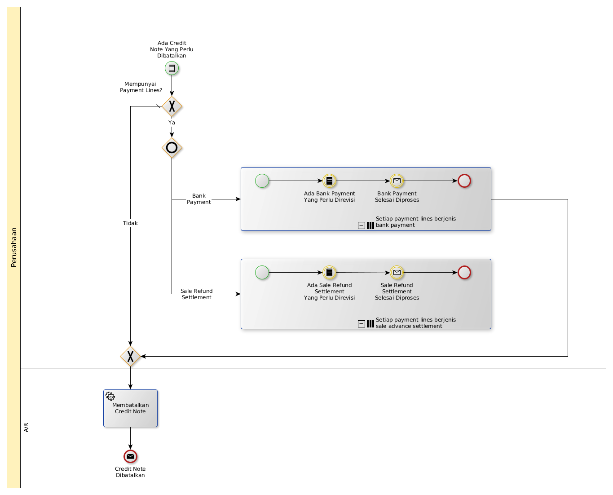

# Membatalkan Credit Note

## <a name="input">A. INPUT</a>

*Condition*: Ada credit note yang tidak jadi diterbitkan

## <a name="role">B. ROLE YANG TERLIBAT</a>

* A/R

## <a name="instruksi">C. INSTRUKSI KERJA</a>

## <a name="input">D. END</a>

*Message*: Credit Note selesai dibatalkan
