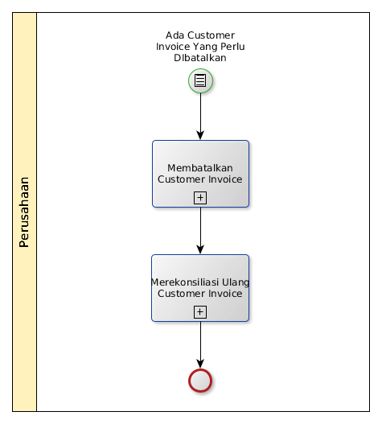

# Membatalkan Customer Invoice

## <a name="input">A. INPUT</a>

Ada customer invoice yang salah

## <a name="role">B. ROLE YANG TERLIBAT</a>

* A/R
* Bank Cashier
* Cash Cashier

## <a name="instruksi">C. INSTRUKSI KERJA</a>

