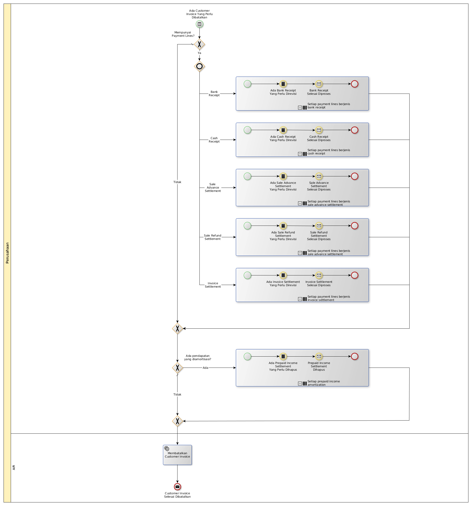

# Membatalkan Customer Invoice

## <a name="input">A. INPUT</a>

Ada customer invoice yang salah

## <a name="role">B. ROLE YANG TERLIBAT</a>

## <a name="instruksi">C. INSTRUKSI KERJA</a>

## <a name="input">D. END</a>

*Tidak ada end event spesifik*
