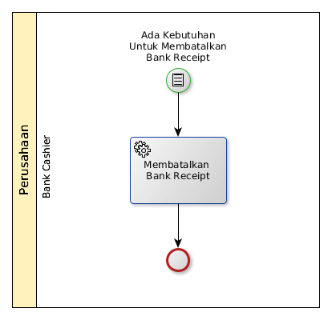

# Membatalkan Penerimaan Bank

## <a name="input">A. START</a>

* Condition: Ada kebutuhan untuk membatalkan penerimaan bank

## <a name="role">B. ROLE YANG TERLIBAT</a>

* Bank Cashier

## <a name="instruksi">C. INSTRUKSI KERJA</a>

### C.1 Membatalkan Bank Receipt

#### C.1.1 Instruksi Kerja Utama

[Odoo - Finance & Accounting: 2.6.7](https://open-synergy.github.io/mdbook-fa/transaksi/bank-receipt/batal.html)

## <a name="input">D. END</a>

*Tidak ada end event spesifik*
