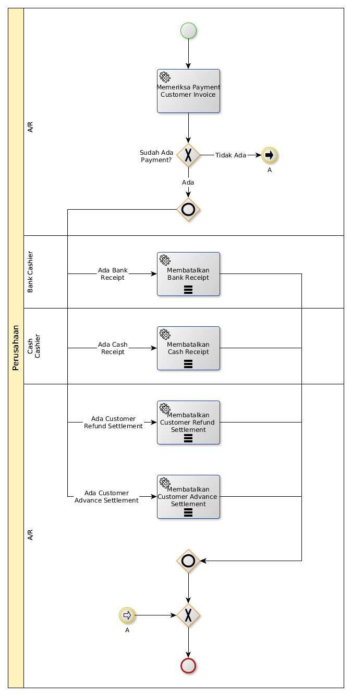

# Membatalkan Rekonsiliasi Customer Invoice

## <a name="input">A. START</a>

*Tidak ada start event spesifik*

## <a name="role">B. ROLE YANG TERLIBAT</a>

* A/R
* Bank Cashier
* Cash Cashier

## <a name="instruksi">C. INSTRUKSI KERJA</a>

## <a name="input">D. END</a>

*Tidak ada end event spesifik*
