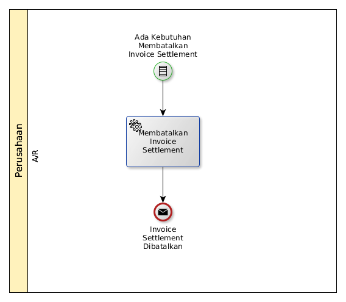

# Membatalkan Settlement Customer Invoice Dengan Supplier Invoice

## <a name="input">A. INPUT</a>

*Condition*: Ada kebutuhan untuk membatalkan invoice settlement

## <a name="role">B. ROLE YANG TERLIBAT</a>

* A/R

## <a name="instruksi">C. INSTRUKSI KERJA</a>

## <a name="output">D. OUTPUT</output>

*Message*: Invoice Settlement dibatalkan
