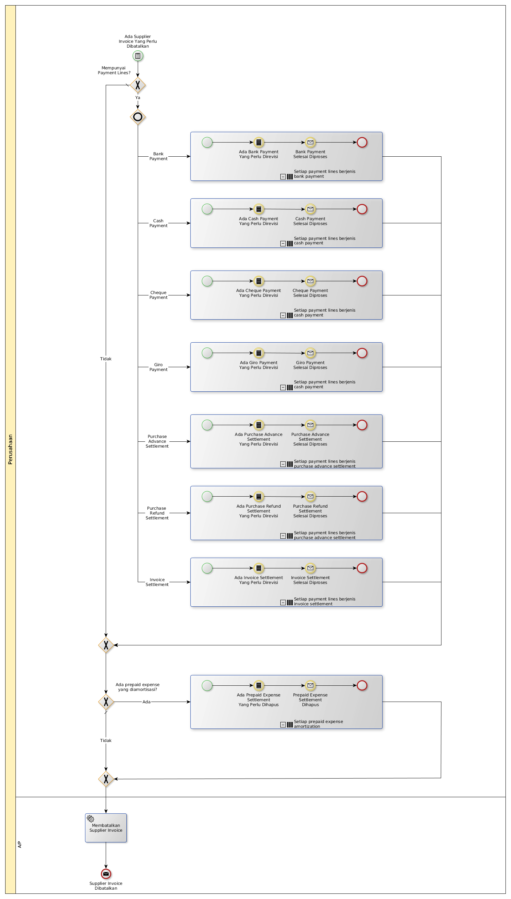

# Membatalkan Supplier Invoice

## <a name="input">A. INPUT</a>

*Condition*: Ada supplier invoice yang tidak jadi valid

## <a name="role">B. ROLE YANG TERLIBAT</a>

* A/P

## <a name="instruksi">C. INSTRUKSI KERJA</a>

## <a name="input">D. END</a>

*Message*: Supplier Invoice dibatalkan
