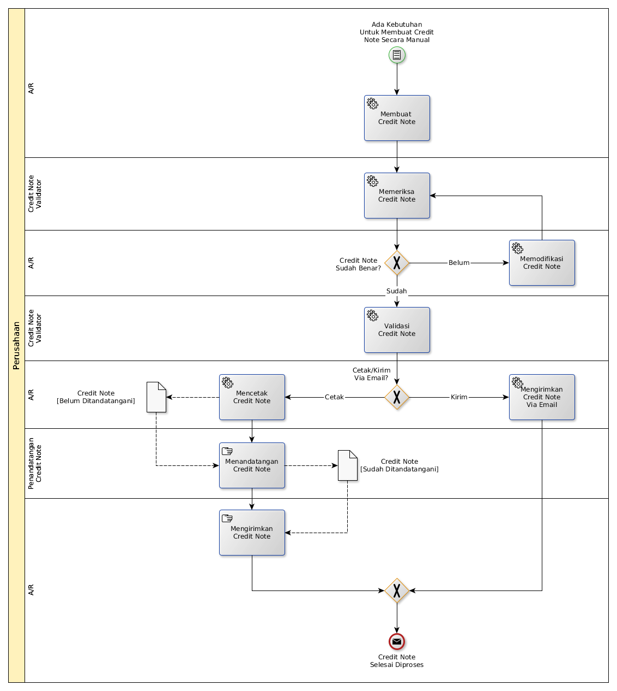

# Merilis Credit Note Secara Manual

## <a name="input">A. START</a>

* Condition: Ada kebutuhan untuk merilis credit note secara manual

## <a name="role">B. ROLE YANG TERLIBAT</a>

* A/R
* Credit Note Validator
* Penandatangan Credit Note

## <a name="instruksi">C. INSTRUKSI KERJA</a>

## <a name="input">D. END</a>

*Message*: Credit Note selesai diproses
