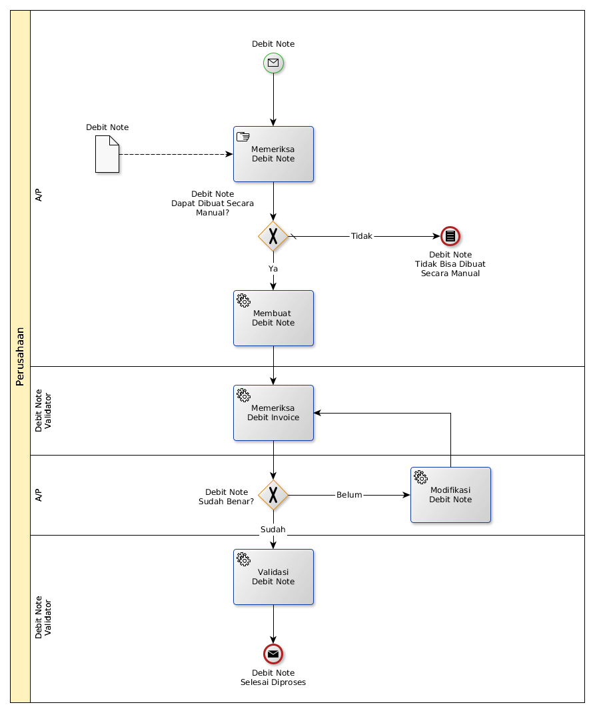

# Menerima Debit Note Secara Manual

## <a name="input">A. START</a>

*Message*: Ada Debit Note diterima

## <a name="role">B. ROLE YANG TERLIBAT</a>

* A/P
* Debit Note Validator

## <a name="instruksi">C. INSTRUKSI KERJA</a>

## <a name="input">D. END</a>

*Message*: Debit Note selesai diproses
