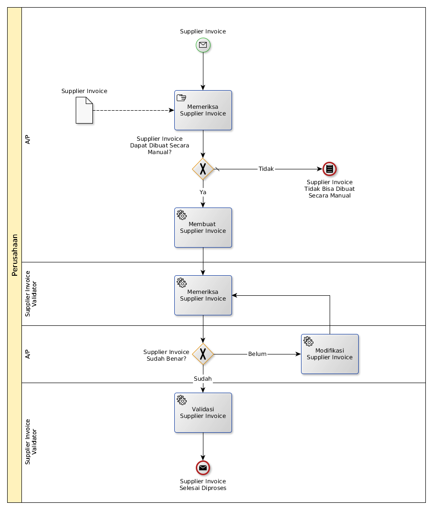

# Menerima Supplier Invoice Secara Manual

## <a name="input">A. START</a>

*Condition*: Ada supplier invoice diterima

## <a name="role">B. ROLE YANG TERLIBAT</a>

* A/P
* Supplier Invoice Validator

## <a name="instruksi">C. INSTRUKSI KERJA</a>

## <a name="input">D. END</a>

*Message*: Supplier Invoice selesai diproses
