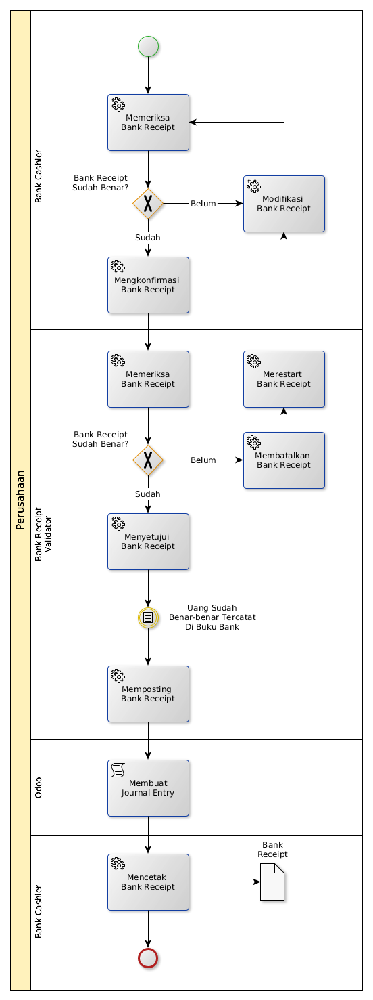

# Memproses Penerimaan Bank

## <a name="input">A. START</a>

*Tidak ada start event spesifik*

## <a name="role">B. ROLE YANG TERLIBAT</a>

* Bank Cashier
* Bank Cashier Validator

## <a name="instruksi">C. INSTRUKSI KERJA</a>

### C.2 Memeriksa Bank Receipt

#### C.1.1 Instruksi Kerja Utama

*(Tidak ada instruksi kerja spesifik)*

### C.2 Mengkonfirmasi Bank Receipt

#### C.2.1 Instruksi Kerja Utama

[Odoo - Finance & Accounting: 2.6.3](https://open-synergy.github.io/mdbook-fa/transaksi/bank-receipt/konfirmasi.html)

### C.3 Menyetujui Bank Receipt

#### C.3.1 Instruksi Kerja Utama

[Odoo - Finance & Accounting: 2.6.4](https://open-synergy.github.io/mdbook-fa/transaksi/bank-receipt/approve.html)

### C.4 Memposting Bank Receipt

#### C.4.1 Instruksi Kerja Utama

[Odoo - Finance & Accounting: 2.6.6](https://open-synergy.github.io/mdbook-fa/transaksi/bank-receipt/post.html)

### C.5 Membatalkan Bank Receipt

#### C.5.1 Instruksi Kerja Utama

[Odoo - Finance & Accounting: 2.6.7](https://open-synergy.github.io/mdbook-fa/transaksi/bank-receipt/batal.html)

### C.6 Merestart Bank Receipt

#### C.6.1 Instruksi Kerja Utama

[Odoo - Finance & Accounting: 2.6.8](https://open-synergy.github.io/mdbook-fa/transaksi/bank-receipt/restart.html)

### C.7 Mencetak Bank Receipt

#### C.7.1 Instruksi Kerja Utama

*(Tidak ada instruksi kerja spesifik)*

## <a name="input">D. END</a>

*Tidak ada end event spesifik*
