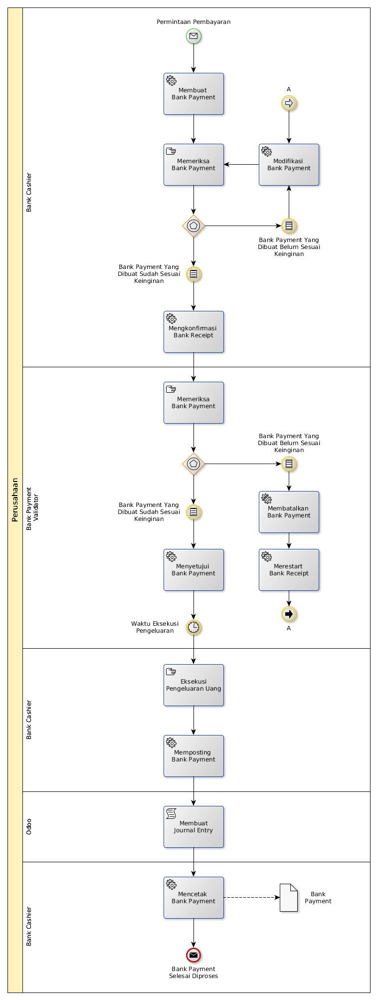

# Mengeluarkan Uang Melalui Bank

## <a name="input">A. INPUT</a>

*Condition*: Ada permintaan pembayaran

## <a name="role">B. ROLE YANG TERLIBAT</a>

* Bank Cashier
* Bank Payment Validator

## <a name="instruksi">C. INSTRUKSI KERJA</a>

### C.1 Membuat Bank Payment

#### C.1.1 Instruksi Kerja Utama

[Odoo - Finance & Accounting: 2.7.2](https://open-synergy.github.io/mdbook-fa/transaksi/bank-payment/membuat.html)

#### C.1.2 Sub Instruksi Kerja

* [Odoo - Finance & Accounting: 2.7.2.1.1](https://open-synergy.github.io/mdbook-fa/transaksi/bank-payment/membuat-detail-import.html)
* [Odoo - Finance & Accounting: 2.7.2.1.2](https://open-synergy.github.io/mdbook-fa/transaksi/bank-payment/membuat-detail-manual.html)

### C.2 Mengkonfirmasi Bank Payment

#### C.2.1 Instruksi Kerja Utama

[Odoo - Finance & Accounting: 2.7.3](https://open-synergy.github.io/mdbook-fa/transaksi/bank-payment/konfirmasi.html)

### C.3 Menyetujui Bank Payment

#### C.3.1 Instruksi Kerja Utama

[Odoo - Finance & Accounting: 2.7.4](https://open-synergy.github.io/mdbook-fa/transaksi/bank-payment/approve.html)

### C.4 Memposting Bank Payment

#### C.4.1 Instruksi Kerja Utama

[Odoo - Finance & Accounting: 2.7.6](https://open-synergy.github.io/mdbook-fa/transaksi/bank-payment/post.html)

### C.5 Membatalkan Bank Payment

#### C.5.1 Instruksi Kerja Utama

[Odoo - Finance & Accounting: 2.7.7](https://open-synergy.github.io/mdbook-fa/transaksi/bank-payment/batal.html)

### C.6 Merestart Bank Payment

#### C.6.1 Instruksi Kerja Utama

[Odoo - Finance & Accounting: 2.7.8](https://open-synergy.github.io/mdbook-fa/transaksi/bank-payment/restart.html)

### C.7 Mencetak Bank Payment

#### C.7.1 Instruksi Kerja Utama

## <a name="output">D. OUTPUT</output>

*Message*: Bank Payment selesai diproses
