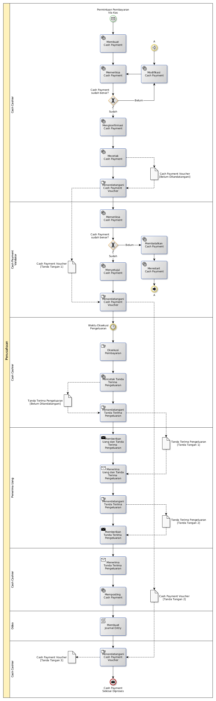

# Mengeluarkan Uang Melalui Kas

## <a name="input">A. INPUT</a>

Ada permintaan pembayaran

## <a name="role">B. ROLE YANG TERLIBAT</a>

* Cash Cashier
* Cash Payment Validator

## <a name="instruksi">C. INSTRUKSI KERJA</a>

### C.1 Membuat Cash Payment

#### C.1.1 Instruksi Kerja Utama

[Odoo - Finance & Accounting: 2.9.2](https://open-synergy.github.io/mdbook-fa/transaksi/cash-payment/membuat.html)

#### C.1.2 Sub Instruksi Kerja

* [Odoo - Finance & Accounting: 2.9.2.1.1](https://open-synergy.github.io/mdbook-fa/transaksi/cash-payment/membuat-detail-import.html)
* [Odoo - Finance & Accounting: 2.9.2.1.2](https://open-synergy.github.io/mdbook-fa/transaksi/cash-payment/membuat-detail-manual.html)

### C.2 Mengkonfirmasi Cash Payment

#### C.2.1 Instruksi Kerja Utama

[Odoo - Finance & Accounting: 2.9.3](https://open-synergy.github.io/mdbook-fa/transaksi/cash-payment/konfirmasi.html)

### C.3 Menyetujui Cash Payment

#### C.3.1 Instruksi Kerja Utama

[Odoo - Finance & Accounting: 2.9.4](https://open-synergy.github.io/mdbook-fa/transaksi/cash-payment/approve.html)

### C.4 Memposting Cash Payment

#### C.4.1 Instruksi Kerja Utama

[Odoo - Finance & Accounting: 2.9.6](https://open-synergy.github.io/mdbook-fa/transaksi/cash-payment/post.html)

### C.5 Membatalkan Cash Payment

#### C.5.1 Instruksi Kerja Utama

[Odoo - Finance & Accounting: 2.9.7](https://open-synergy.github.io/mdbook-fa/transaksi/cash-payment/batal.html)

### C.6 Merestart Cash Payment

#### C.6.1 Instruksi Kerja Utama

[Odoo - Finance & Accounting: 2.9.8](https://open-synergy.github.io/mdbook-fa/transaksi/cash-payment/restart.html)

### C.7 Mencetak Cash Payment

#### C.7.1 Instruksi Kerja Utama

## <a name="output">D. OUTPUT</output>
