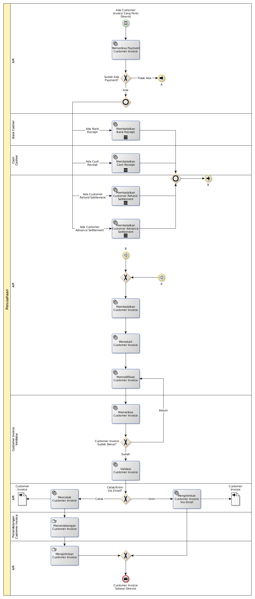

# Merevisi Customer Invoice

## <a name="input">A. INPUT</a>

Ada kebutuhan untuk merevisi invoice

## <a name="role">B. ROLE YANG TERLIBAT</a>

* A/R
* Customer Invoice Validator
* Penandatangan Invoice
* Bank Cashier
* Cash Cashier

## <a name="instruksi">C. INSTRUKSI KERJA</a>

