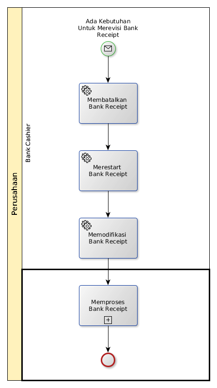

# Merevisi Penerimaan Bank

## <a name="input">A. START</a>

* Condition: Ada kebutuhan untuk merevisi bank receipt

## <a name="role">B. ROLE YANG TERLIBAT</a>

* Bank Cashier

## <a name="instruksi">C. INSTRUKSI KERJA</a>

### C.1 Membatalkan Bank Receipt

#### C.1.1 Instruksi Kerja Utama

[Odoo - Finance & Accounting: Membatalkan Bank Receipt](https://open-synergy.github.io/mdbook-fa/transaksi/bank-receipt/batal.html)

### C.2 Merestart Bank Receipt

#### C.2.1 Instruksi Kerja Utama

[Odoo - Finance & Accounting: Merestart Bank Receipt](https://open-synergy.github.io/mdbook-fa/transaksi/bank-receipt/restart.html)

### C.3 Memodifikasi Bank Receipt

#### C.3.1 Instruksi Kerja Utama

[Odoo - Finance & Accounting: Memodifikasi Bank Receipt](https://open-synergy.github.io/mdbook-fa/transaksi/bank-receipt/memodifikasi.html)

### C.4 Memproses Bank Receipt

#### C.4.1 Sub-proses

[Odoo - Prosedur Umum: Memproses Penerimaan Bank](https://open-synergy.github.io/mdbook-prosedur-umum/fa/memproses-penerimaan-bank.html)

## <a name="input">D. END</a>

*Tidak ada end event spesifik*
