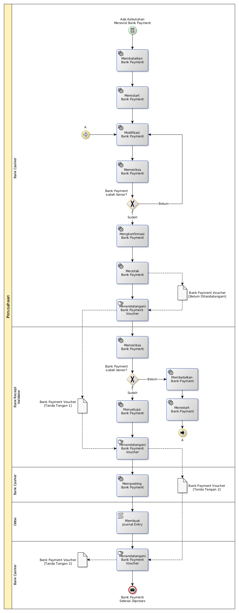

# Merevisi Pengeluaran Bank

## <a name="input">A. INPUT</a>

*Condition*: Ada kebutuhan untuk merevisi Bank Payment

## <a name="role">B. ROLE YANG TERLIBAT</a>

* Bank Cashier
* Bank Payment Validator

## <a name="instruksi">C. INSTRUKSI KERJA</a>

## <a name="input">D. END</a>

*Message*: Bank Payment selesai diproses
