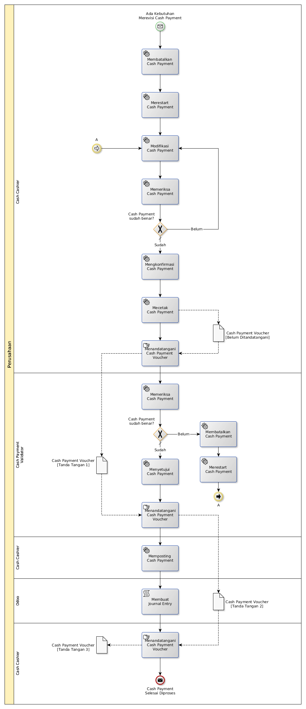

# Merevisi Pengeluaran Kas

## <a name="input">A. INPUT</a>

*Condition*: Ada kebutuhan untuk merevisi Cash Payment

## <a name="role">B. ROLE YANG TERLIBAT</a>

* Cash Cashier
* Cash Payment Validator

## <a name="instruksi">C. INSTRUKSI KERJA</a>

## <a name="input">D. END</a>

*Message*: Cash Payment selesai diproses
