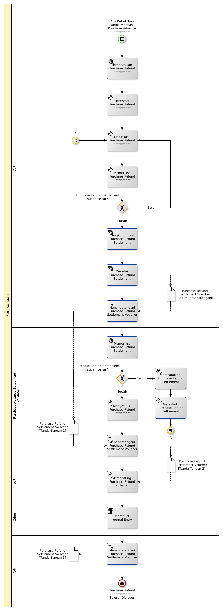

# Merevisi Settlement Supplier Invoice Dengan Debit Note

## <a name="input">A. INPUT</a>

*Condition*: Ada kebutuhan untuk merevisi purchase refund settlement

## <a name="role">B. ROLE YANG TERLIBAT</a>

* A/P
* Purchase Refund Settlement Validator

## <a name="instruksi">C. INSTRUKSI KERJA</a>

## <a name="output">D. OUTPUT</output>

*Message*: Purchase Refund Settlement selesai diproses
