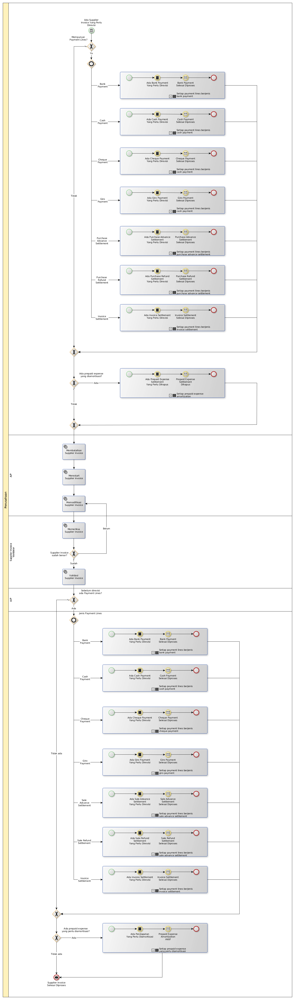

# Merevisi Supplier Invoice

## <a name="input">A. INPUT</a>

*Condition*: Ada kebutuhan untuk merevisi supplier invoice

## <a name="role">B. ROLE YANG TERLIBAT</a>

* A/P
* Supplier Invoice Validator

## <a name="instruksi">C. INSTRUKSI KERJA</a>

## <a name="input">D. END</a>

*Message*: Supplier Invoice selesai diproses
