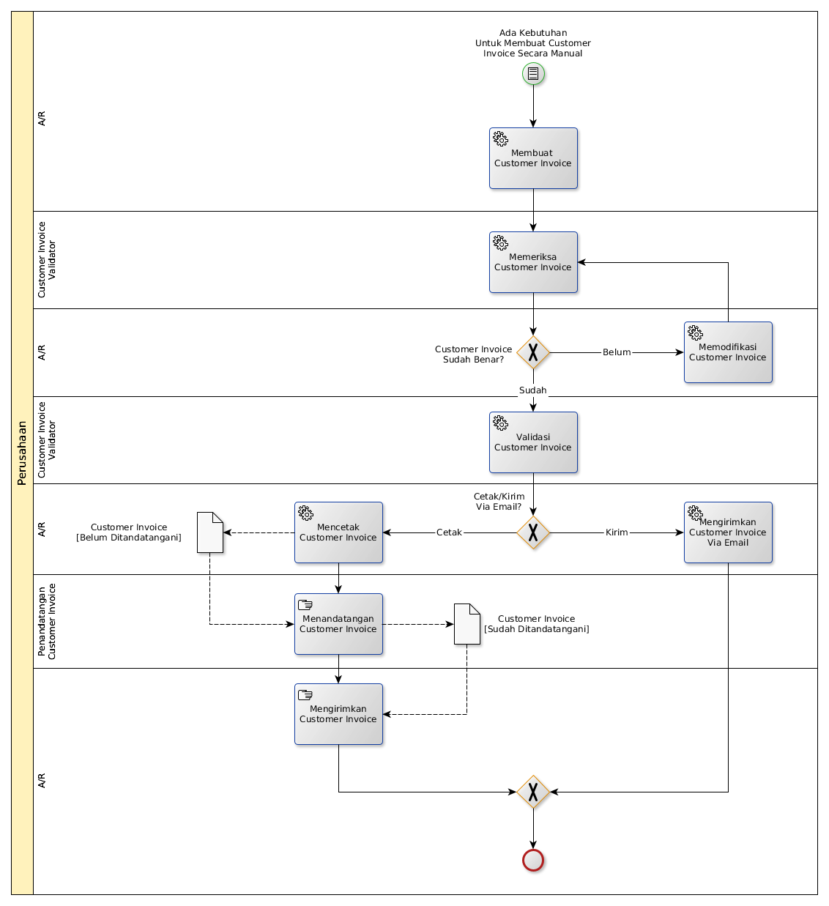

# Merilis Customer Invoice Secara Manual

## <a name="input">A. START</a>

* Condition: Ada kebutuhan untuk merilis invoice secara manual

## <a name="role">B. ROLE YANG TERLIBAT</a>

* A/R
* Customer Invoice Validator
* Penandatangan Invoice

## <a name="instruksi">C. INSTRUKSI KERJA</a>

## <a name="input">D. END</a>

*Tidak ada end event spesifik*
