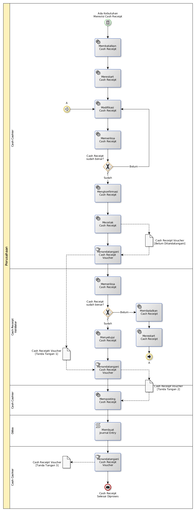

# Merevisi Penerimaan Kas

## <a name="input">A. INPUT</a>

*Condition*: Ada kebutuhan merevisi Cash Receipt

## <a name="role">B. ROLE YANG TERLIBAT</a>

* Cash Cashier
* Cash Receipt Settlement Validator

## <a name="instruksi">C. INSTRUKSI KERJA</a>

## <a name="output">D. OUTPUT</output>

*Message*: Cash Receipt selesai diproses
