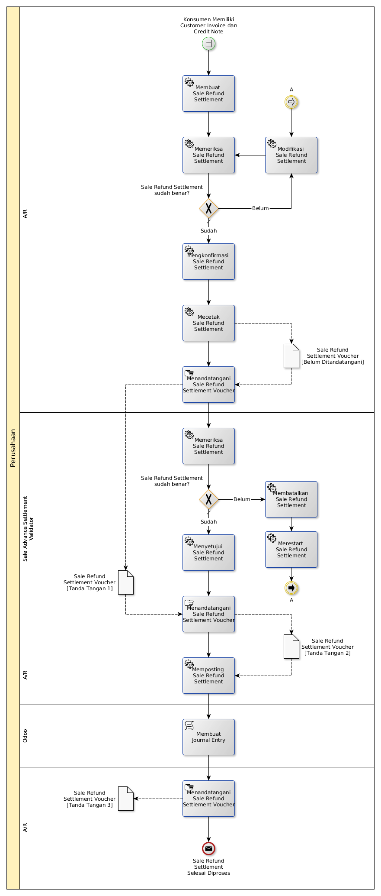

# Settlement Customer Invoice Dengan Credit Note

## <a name="input">A. INPUT</a>

*Condition*: Ada konsumen yang memiliki customer invoice dan credit note

## <a name="role">B. ROLE YANG TERLIBAT</a>

* A/R
* Sale Refund Settlement Validator

## <a name="instruksi">C. INSTRUKSI KERJA</a>

## <a name="output">D. OUTPUT</output>

*Message*: Sale Refund Settlement selesai diproses
