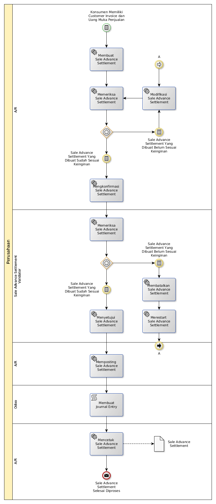

# Settlement Customer Invoice Dengan Uang Muka Penjualan

## <a name="input">A. INPUT</a>

*Condition*: Ada konsumen yang memiliki customer invoice dan uang muka penjualan

## <a name="role">B. ROLE YANG TERLIBAT</a>

* A/R
* Sale Advance Settlement Validator

## <a name="instruksi">C. INSTRUKSI KERJA</a>

### C.1 Membuat Sale Advance Settlement

#### C.1.1 Instruksi Kerja Utama

[Odoo - Finance & Accounting: 2.14.2](https://open-synergy.github.io/mdbook-fa/transaksi/sale-advance-settlement/membuat.html)

#### C.1.2 Sub Instruksi Kerja

* [Odoo - Finance & Accounting: 2.14.2.1.1](https://open-synergy.github.io/mdbook-fa/transaksi/sale-advance-settlement/membuat-detail-import.html)
* [Odoo - Finance & Accounting: 2.14.2.1.2](https://open-synergy.github.io/mdbook-fa/transaksi/sale-advance-settlement/membuat-detail-manual.html)

### C.2 Mengkonfirmasi Sale Advance Settlement

#### C.2.1 Instruksi Kerja Utama

[Odoo - Finance & Accounting: 2.14.3](https://open-synergy.github.io/mdbook-fa/transaksi/sale-advance-settlement/konfirmasi.html)

### C.3 Menyetujui Sale Advance Settlement

#### C.3.1 Instruksi Kerja Utama

[Odoo - Finance & Accounting: 2.14.4](https://open-synergy.github.io/mdbook-fa/transaksi/sale-advance-settlement/approve.html)

### C.4 Memposting Sale Advance Settlement

#### C.4.1 Instruksi Kerja Utama

[Odoo - Finance & Accounting: 2.14.6](https://open-synergy.github.io/mdbook-fa/transaksi/sale-advance-settlement/post.html)

### C.5 Membatalkan Sale Advance Settlement

#### C.5.1 Instruksi Kerja Utama

[Odoo - Finance & Accounting: 2.14.7](https://open-synergy.github.io/mdbook-fa/transaksi/sale-advance-settlement/batal.html)

### C.6 Merestart Sale Advance Settlement

#### C.6.1 Instruksi Kerja Utama

[Odoo - Finance & Accounting: 2.14.8](https://open-synergy.github.io/mdbook-fa/transaksi/sale-advance-settlement/restart.html)

### C.7 Mencetak Sale Advance Settlement

#### C.7.1 Instruksi Kerja Utama

## <a name="output">D. OUTPUT</output>

*Message*: Sale Advance Settlement selesai diproses
