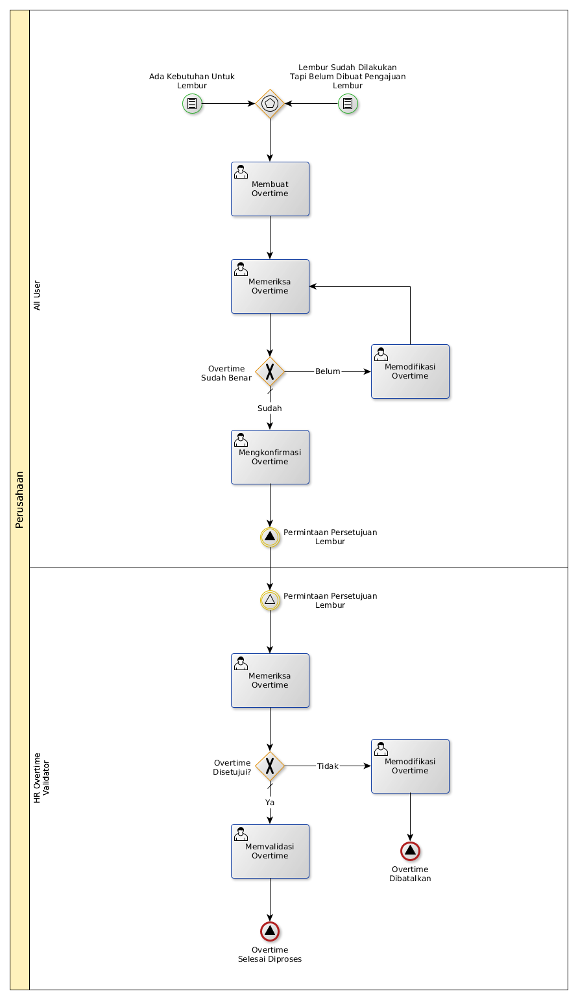

# Membuat Overtime Request

## <a name="input">A. INPUT</a>

* *Condition*: Ada **kebutuhan untuk lembur**, atau
* *Condition*: Ada **lembur sudah dilakukan tapi belum dibuat pengajuan lembur**

## <a name="role">B. ROLE YANG TERLIBAT</a>

* All User
* HR Overtime Validator

## <a name="instruksi">C. INSTRUKSI KERJA</a>

## <a name="input">D. OUTPUT</a>

* *Signal*: Notifikasi **Permintaan Persetujuan Lembur Selesai Diproses**, atau
* *Signal*: Notifikasi **Permintaan Persetujuan Lembur Dibatalkan**
