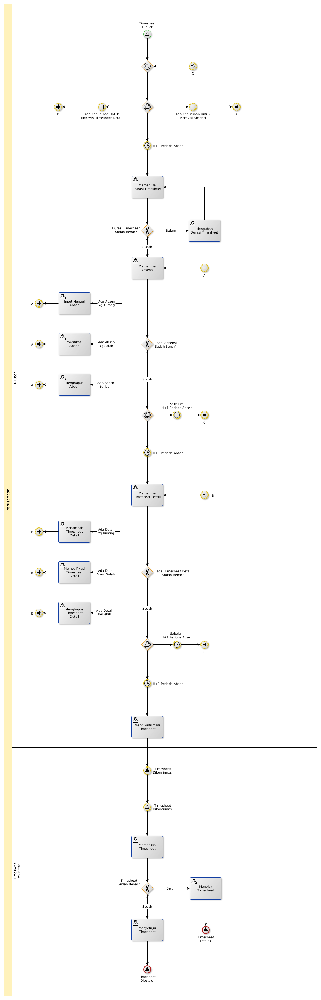

# Mengumpulkan Timesheet

## <a name="input">A. INPUT</a>

* Timesheet Ditolak
* H+1 Periode Absen

## <a name="role">B. ROLE YANG TERLIBAT</a>

* All User

## <a name="instruksi">C. INSTRUKSI KERJA</a>

