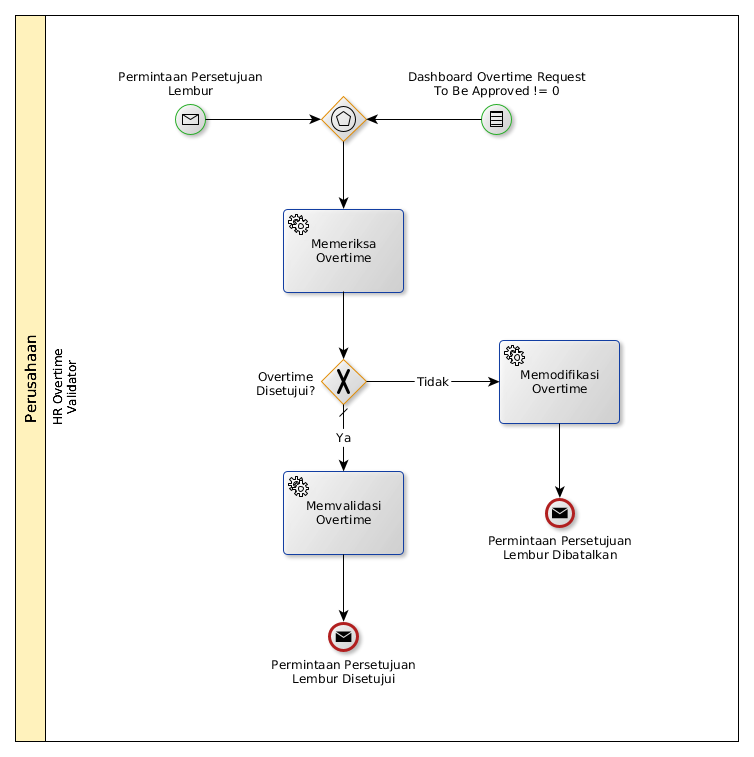

# Menyetujui/Menolak Overtime Request

## <a name="input">A. INPUT</a>

* *Message*: Notifikasi **Permintaan Persetujuan Lembur**, atau
* *Condition*: Dashboard **Overtime Request: To Be Approved != 0**

## <a name="role">B. ROLE YANG TERLIBAT</a>

* HR Overtime Validator

## <a name="instruksi">C. INSTRUKSI KERJA</a>

## <a name="input">D. OUTPUT</a>

* *Message*: Notifikasi **Permintaan Persetujuan Lembur Disetujui**, atau
* *Message*: Notifikasi **Permintaan Persetujuan Lembur Dibatalkan**
