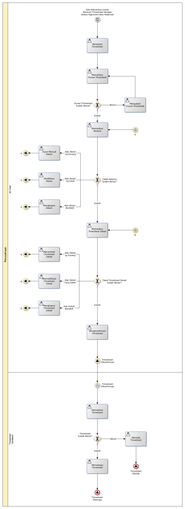

# Merevisi Timesheet

## <a name="input">A. INPUT</a>

* *Condition*: Ada kebutuhan untuk merevisi timesheet dengan status **Approved** atau **Rejected**

## <a name="role">B. ROLE YANG TERLIBAT</a>

* All User
* Timesheet Validator

## <a name="instruksi">C. INSTRUKSI KERJA</a>

## <a name="output">D. OUTPUT</a>

* *Signal*: Notifikasi **Timesheet Disetujui**, atau
* *Signal*: Notifikasi **Timesheet Ditolak**
