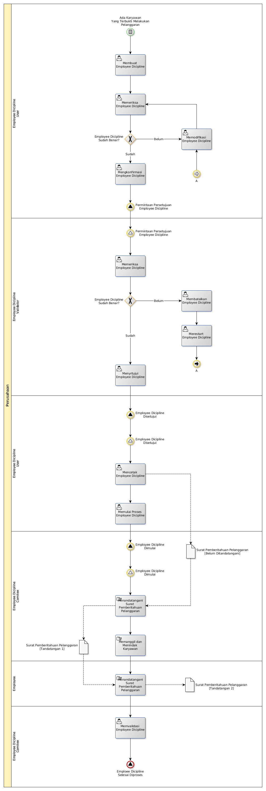

# Memberikan Sanksi

## <a name="input">A. START EVENT</a>

* Ada karyawan yang melakukan pelanggaran

## <a name="role">B. ROLE YANG TERLIBAT</a>

* Carrer Administration
* Career Administration Manager

## <a name="instruksi">C. INSTRUKSI KERJA</a>

