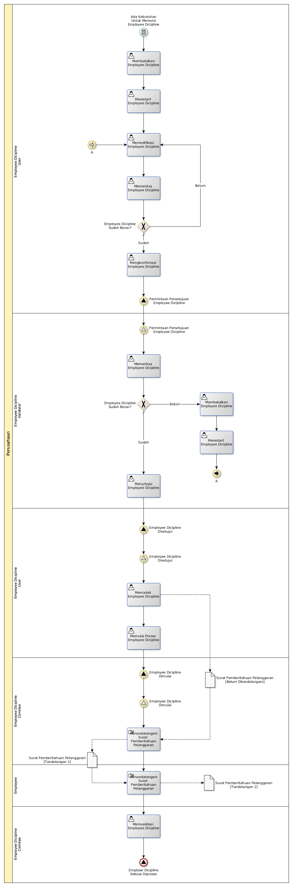

# Merevisi Employee Dicipline

## <a name="input">A. START EVENT</a>

* *Condition*: Ada

## <a name="role">B. ROLE YANG TERLIBAT</a>

* Employee Dicipline User
* Employee Dicipline Validator
* Employee Dicipline Comitee

## <a name="instruksi">C. INSTRUKSI KERJA</a>

## <a name="output">D. OUTPUT</a>

* *Signal*: Notifikasi **Employee Dicipline Selesai Diproses**
