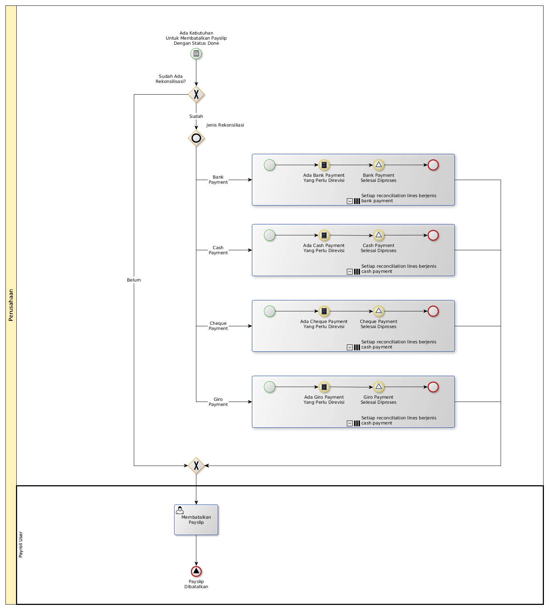

# Membatalkan Payslip

## <a name="input">A. INPUT</a>

* *Condition*: Ada **kebutuhan untuk membatalkan payslip dengan status done**

## <a name="role">B. ROLE YANG TERLIBAT</a>

* Payroll User

## <a name="prosedur">C. PROSEDUR KERJA</a>

## <a name="input">D. OUTPUT</a>

* *Signal*: Notifikasi **Payslip Dibatalkan**
