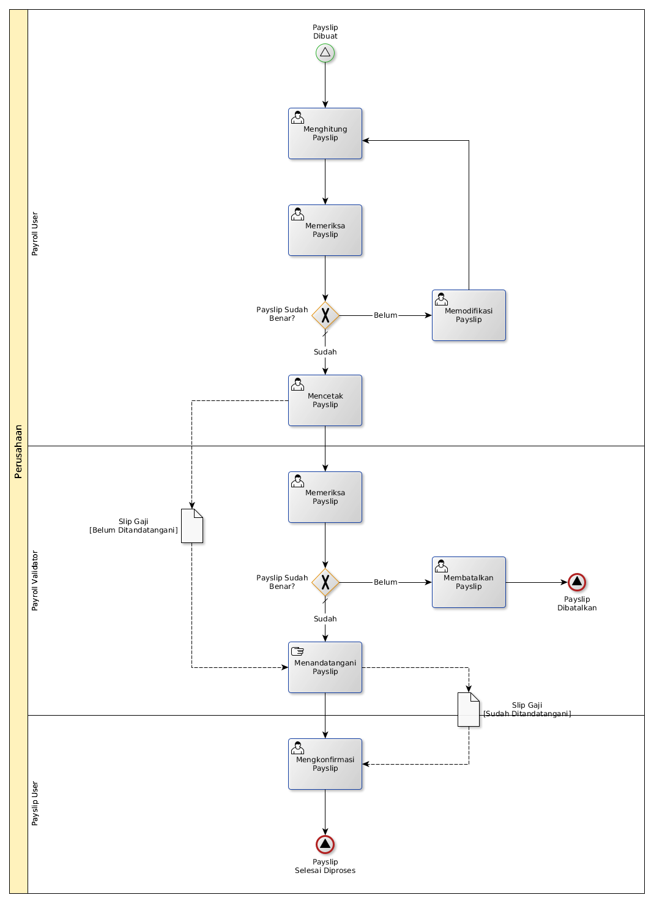

# Memproses Payslip

## <a name="input">A. INPUT</a>

* *Signal*: Notifikasi **Payslip Dibuat**

## <a name="role">B. ROLE YANG TERLIBAT</a>

* Payroll User
* Payroll Validator

## <a name="prosedur">C. PROSEDUR KERJA</a>

## <a name="input">D. OUTPUT</a>

* *Signal*: Notifikasi **Payslip Selesai Diproses**, atau
* *Signal*: Notifikasi **Payslip Dibatalkan**
