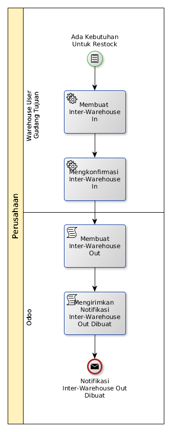

# Meminta Barang Dari Gudang Lain

## <a name="input">A. INPUT</a>

Kebutuhan akan restock yang bisa dipenuhi oleh gudang lain

## <a name="role">B. ROLE YANG TERLIBAT</a>

* Warehouse User Gudang Tujuan

## <a name="instruksi">C. INSTRUKSI KERJA</a>

### C.1 Membuat Interwarehouse-In

#### C.1.1 Instruksi Kerja Utama

[Odoo - Inventory: 1.2.2](https://open-synergy.github.io/mdbook-inventory/transaksi/interwarehouse-in/membuat.html)

#### C.1.2 Sub Instruksi Kerja

* [Odoo - Inventory: 1.2.3](https://open-synergy.github.io/mdbook-inventory/transaksi/interwarehouse-in/produk-tambah.html)
* [Odoo - Inventory: 1.2.4](https://open-synergy.github.io/mdbook-inventory/transaksi/interwarehouse-in/produk-modifikasi.html)
* [Odoo - Inventory: 1.2.5](https://open-synergy.github.io/mdbook-inventory/transaksi/interwarehouse-in/produk-hapus.html)

### C.2 Mengkonfirmasi Interwarehouse-In

#### C.2.1 Instruksi Kerja Utama

[Odoo - Inventory: 1.2.6](https://open-synergy.github.io/mdbook-inventory/transaksi/interwarehouse-in/konfirmasi.html)

## <a name="output">D. OUTPUT</output>

Notifikasi mengenai adanya inter-warehouse out yang harus diproses kepada Warehouse User Gudang Tujuan.
