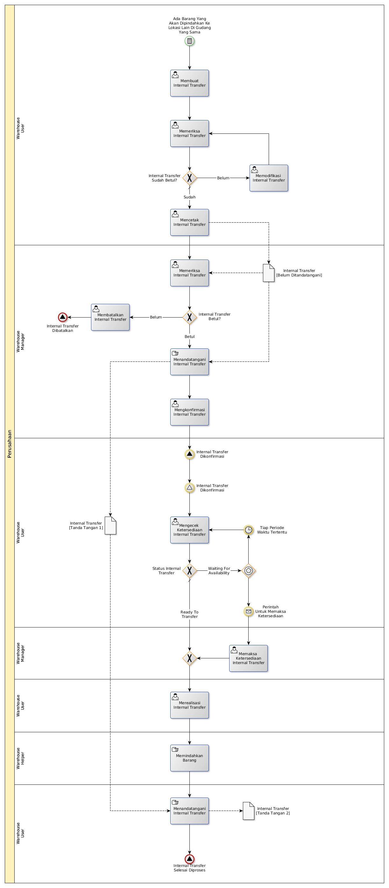

# Memindahkan Barang Dari Antar Lokasi Di Gudang Yang Sama

## <a name="input">A. INPUT</a>

Ada kebutuhan untuk memindahkan barang antar lokasi di gudang yang sama.

## <a name="role">B. ROLE YANG TERLIBAT</a>

* Warehouse User
* Warehouse Manager
* Warehouse Helper

## <a name="instruksi">C. INSTRUKSI KERJA</a>

### C.1 Membuat Internal Transfer

#### C.1.1 Instruksi Kerja Utama

[Odoo - Inventory: 1.8.2](https://open-synergy.github.io/mdbook-inventory/transaksi/internal-transfer/membuat.html)

### C.2 Memeriksa Internal Transfer

#### C.2.1 Instruksi Kerja Utama

[Odoo - Inventory: 1.8.9](https://open-synergy.github.io/mdbook-inventory/transaksi/internal-transfer/check.html)

### C.3 Mengkonfirmasi Internal Transfer

#### C.3.1 Instruksi Kerja Utama

[Odoo - Inventory: 1.8.8](https://open-synergy.github.io/mdbook-inventory/transaksi/internal-transfer/konfirmasi.html)

### C.4 Memodifikasi Internal Transfer

#### C.4.1 Instruksi Kerja Utama

[Odoo - Inventory: 1.8.3](https://open-synergy.github.io/mdbook-inventory/transaksi/internal-transfer/modifikasi.html)

### C.5 Mengecek Ketersediaan Internal Transfer

#### C.5.1 Instruksi Kerja Utama

[Odoo - Inventory: 1.8.9](https://open-synergy.github.io/mdbook-inventory/transaksi/internal-transfer/check.html)

### C.6 Memaksa Ketersediaan Internal Transfer

#### C.6.1 Instruksi Kerja Utama

[Odoo - Inventory: 1.8.10](https://open-synergy.github.io/mdbook-inventory/transaksi/internal-transfer/force.html)

### C.7 Merealisasi Internal Transfer

#### C.7.1 Instruksi Kerja Utama

[Odoo - Inventory: 1.8.11](https://open-synergy.github.io/mdbook-inventory/transaksi/internal-transfer/transfer.html)

### C.8 Mencetak Internal Transfer

#### C.8.1 Instruksi Kerja Utama

## <a name="output">D. OUTPUT</output>
