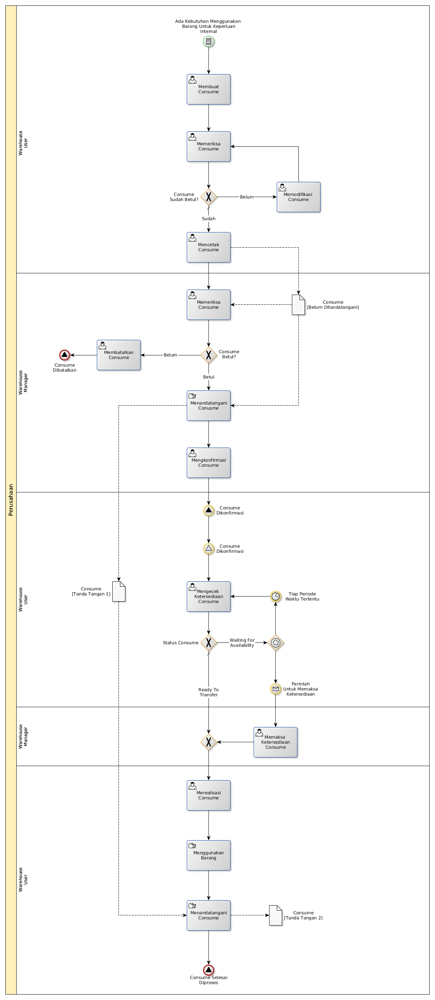

# Menggunakan Barang Untuk Kebutuhan Internal

## <a name="input">A. INPUT</a>

Ada kebutuhan untuk menggunakan barang untuk keperluan internal

## <a name="role">B. ROLE YANG TERLIBAT</a>

* Warehouse User
* Warehouse Manager
* Warehouse Helper

## <a name="instruksi">C. INSTRUKSI KERJA</a>

### C.1 Membuat Consume

#### C.1.1 Instruksi Kerja Utama

[Odoo - Inventory: 1.13.2](https://open-synergy.github.io/mdbook-inventory/transaksi/consume/membuat.html)

### C.2 Memeriksa Consume

#### C.2.1 Instruksi Kerja Utama

[Odoo - Inventory: 1.13.9](https://open-synergy.github.io/mdbook-inventory/transaksi/consume/check.html)

### C.3 Memodifikasi Consume

#### C.3.1 Instruksi Kerja Utama

[Odoo - Inventory: 1.13.3](https://open-synergy.github.io/mdbook-inventory/transaksi/consume/modifikasi.html)

### C.4 Mengkonfirmasi Consume

#### C.4.1 Instruksi Kerja Utama

[Odoo - Inventory: 1.13.8](https://open-synergy.github.io/mdbook-inventory/transaksi/consume/konfirmasi.html)

### C.5 Mengecek Ketersediaan Consume

#### C.5.1 Instruksi Kerja Utama

[Odoo - Inventory: 1.13.9](https://open-synergy.github.io/mdbook-inventory/transaksi/consume/check.html)

### C.6 Memaksa Ketersediaan Consume

#### C.6.1 Instruksi Kerja Utama

[Odoo - Inventory: 1.13.10](https://open-synergy.github.io/mdbook-inventory/transaksi/consume/force.html)

### C.7 Merealisasi Consume

#### C.7.1 Instruksi Kerja Utama

[Odoo - Inventory: 1.13.11](https://open-synergy.github.io/mdbook-inventory/transaksi/consume/transfer.html)

### C.8 Mencetak Consume

#### C.8.1 Instruksi Kerja Utama

## <a name="output">D. OUTPUT</output>
