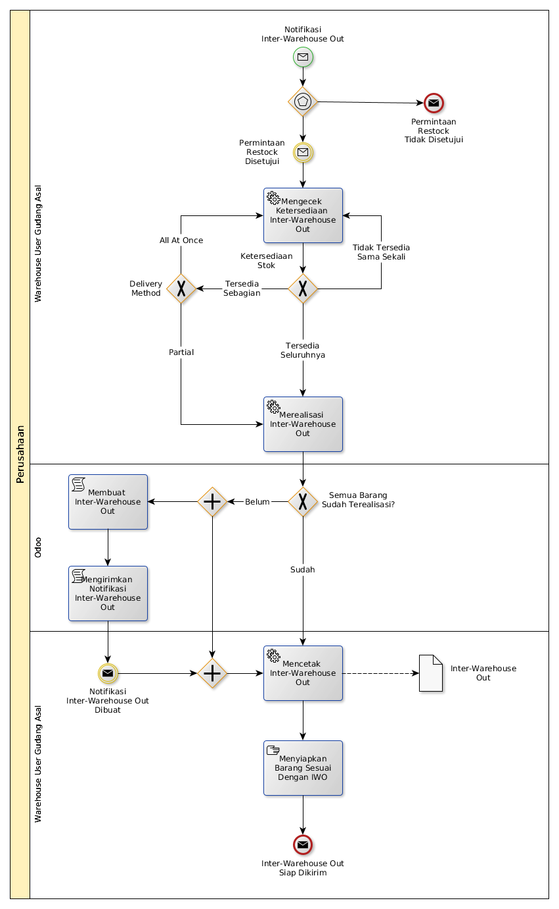

# Memproses Permintaan Barang Dari Gudang Lain

## <a name="input">A. INPUT</a>

Notifikasi mengenai adanya inter-warehouse out yang harus diproses

## <a name="role">B. ROLE YANG TERLIBAT</a>

* Warehouse User Gudang Tujuan

## <a name="instruksi">C. INSTRUKSI KERJA</a>

### C.1 Mengecek Ketersediaan Interwarehouse-Out

#### C.1.1 Instruksi Kerja Utama

[Odoo - Inventory: 1.15.7](https://open-synergy.github.io/mdbook-inventory/transaksi/interwarehouse-out/check.html)

### C.2 Merealisasi Interwarehouse-Out

#### C.2.1 Instruksi Kerja Utama

[Odoo - Inventory: 1.15.8](https://open-synergy.github.io/mdbook-inventory/transaksi/interwarehouse-out/transfer.html)

### C.3 Mencetak Interwarehouse-Out

#### C.3.1 Instruksi Kerja Utama

## <a name="output">D. OUTPUT</output>

Notifikasi bahwa inter-warehouse out siap dikirim
