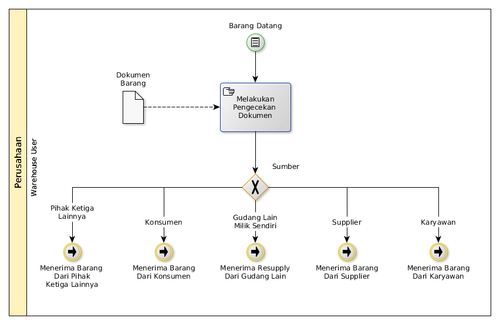

# Menerima Barang

## <a name="input">A. INPUT</a>

Barang diterima di gudang

## <a name="role">B. ROLE YANG TERLIBAT</a>

* Warehouse User

## <a name="instruksi">C. INSTRUKSI KERJA</a>

## <a name="output">D. OUTPUT</output>

Berlanjut ke salah satu prosedur di bawah:

* [Menerima Barang Dari Pihak Ketiga Lainnya](./menerima-pihak-ketiga.md)
* [Menerima Barang Dari Konsumen](./menerima-konsumen.md)
* [Menerima Resupply Dari Gudang Lain](./menerima-resupply.md)
* [Menerima Barang Dari Supplier](./menerima-supplier.md)
* [Menerima Barang Dari Karyawan](./menerima-karyawan.md)
