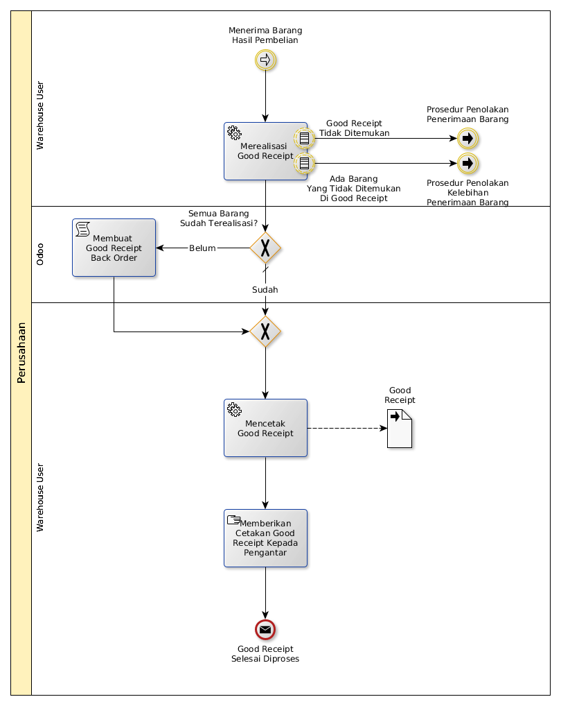

# Menerima Barang Hasil Pembelian

## <a name="input">A. INPUT</a>

Lanjutan dari [Prosedur Menerima Barang Dari Supplier](./menerima-supplier.md)

## <a name="role">B. ROLE YANG TERLIBAT</a>

* Warehouse User

## <a name="instruksi">C. INSTRUKSI KERJA</a>

### C.1 Merealisasi Good Receipt

#### C.1.1 Instruksi Kerja Utama

[Odoo - Inventory: 1.1.5](https://open-synergy.github.io/mdbook-inventory/transaksi/goods-receipt/transfer.html)

### C.2 Mencetak Good Receipt

#### C.2.1 Instruksi Kerja Utama

## <a name="output">D. OUTPUT</output>
