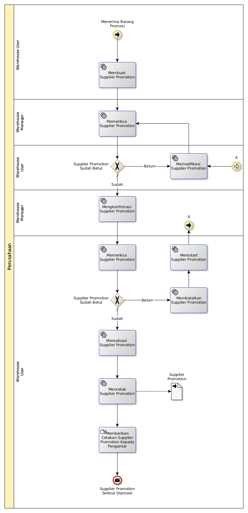

# Menerima Barang Promosi

## <a name="input">A. INPUT</a>

Lanjutan dari [Prosedur Menerima Barang Dari Supplier](./menerima-supplier.md)

## <a name="role">B. ROLE YANG TERLIBAT</a>

* Warehouse User
* Warehouse Manager

## <a name="instruksi">C. INSTRUKSI KERJA</a>

### C.1 Membuat Supplier Promotion

#### C.1.1 Instruksi Kerja Utama

[Odoo - Inventory: 1.3.2](https://open-synergy.github.io/mdbook-inventory/transaksi/supplier-promotion/membuat.html)

### C.2 Memeriksa Supplier Promotion

#### C.2.1 Instruksi Kerja Utama

[Odoo - Inventory: 1.3.9](https://open-synergy.github.io/mdbook-inventory/transaksi/supplier-promotion/check.html)

### C.3 Memodifikasi Supplier Promotion

#### C.3.1 Instruksi Kerja Utama

[Odoo - Inventory: 1.3.3](https://open-synergy.github.io/mdbook-inventory/transaksi/supplier-promotion/modifikasi.html)

### C.4 Mengkonfirmasi Supplier Promotion

#### C.4.1 Instruksi Kerja Utama

[Odoo - Inventory: 1.3.8](https://open-synergy.github.io/mdbook-inventory/transaksi/supplier-promotion/konfirmasi.html)

### C.5 Memeriksa Supplier Promotion

#### C.5.1 Instruksi Kerja Utama

[Odoo - Inventory: 1.3.9](https://open-synergy.github.io/mdbook-inventory/transaksi/supplier-promotion/check.html)

### C.6 Membatalkan Supplier Promotion

#### C.6.1 Instruksi Kerja Utama

[Odoo - Inventory: 1.3.12](https://open-synergy.github.io/mdbook-inventory/transaksi/supplier-promotion/batal.html)

### C.7 Merestart Supplier Promotion

#### C.7.1 Instruksi Kerja Utama

[Odoo - Inventory: 1.3.13](https://open-synergy.github.io/mdbook-inventory/transaksi/supplier-promotion/restart.html)

### C.8 Merealisasi Supplier Promotion

#### C.8.1 Instruksi Kerja Utama

[Odoo - Inventory: 1.3.10](https://open-synergy.github.io/mdbook-inventory/transaksi/supplier-promotion/transfer.html)

### C.9 Mencetak Supplier Promotion

#### C.9.1 Instruksi Kerja Utama

## <a name="output">D. OUTPUT</output>
