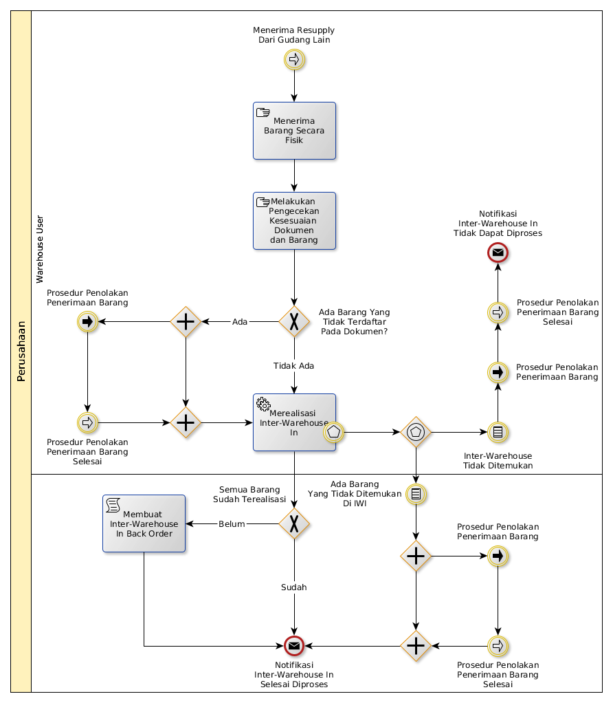

# Menerima Resupply Dari Gudang Lain

## <a name="input">A. INPUT</a>

Lanjutan dari [Prosedur Penerimaan Barang](./menerima-barang.md)

## <a name="role">B. ROLE YANG TERLIBAT</a>

* Warehouse User

## <a name="instruksi">C. INSTRUKSI KERJA</a>

## <a name="output">D. OUTPUT</output>
