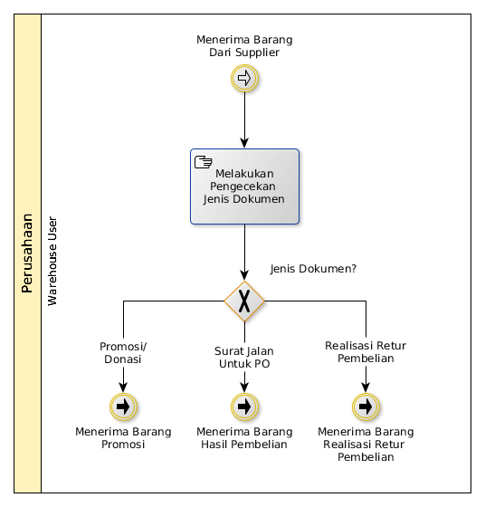

# Menerima Barang Dari Supplier

## <a name="input">A. INPUT</a>

Lanjutan dari [Prosedur Menerima Barang](./menerima-barang.md)

## <a name="role">B. ROLE YANG TERLIBAT</a>

* Warehouse User

## <a name="instruksi">C. INSTRUKSI KERJA</a>

## <a name="output">D. OUTPUT</output>

Berlanjut ke salah satu prosedur di bawah:

* [Menerima Hasil Pembelian](./menerima-hasil-pembelian.md)
