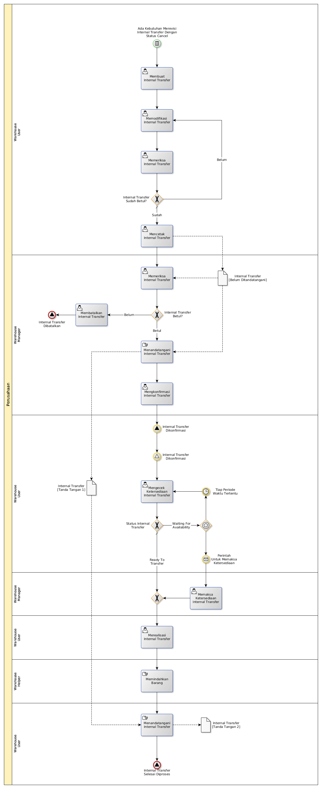

# Merevisi Pemindahan Internal

## <a name="input">A. INPUT</a>

* *Condition*: Ada kebutuhan untuk merevisi internal transfer dengan status cancel

## <a name="role">B. ROLE YANG TERLIBAT</a>

* Warehouse User
* Warehouse Manager
* Warehouse Helper

## <a name="prosedur">C. PROSEDUR KERJA</a>

## <a name="output">D. OUTPUT</output>

* *Signal*: Internal Transfer selesai diproses, atau
* *Signal*: Internal Transfer dibatalkan
