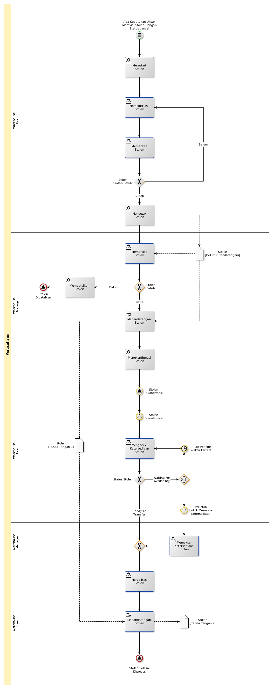

# Merevisi Pencatatan Barang Yang Dicuri

## <a name="input">A. INPUT</a>

* *Condition*: Ada kebutuhan untuk merevisi stolen dengan status **Cancel**

## <a name="role">B. ROLE YANG TERLIBAT</a>

* Warehouse User
* Warehouse Manager

## <a name="prosedur">C. PROSEDUR KERJA</a>

## <a name="output">D. OUTPUT</output>

* *Signal*: Stolen selesai diproses, atau
* *Signal*: Stolen dibatalkan
