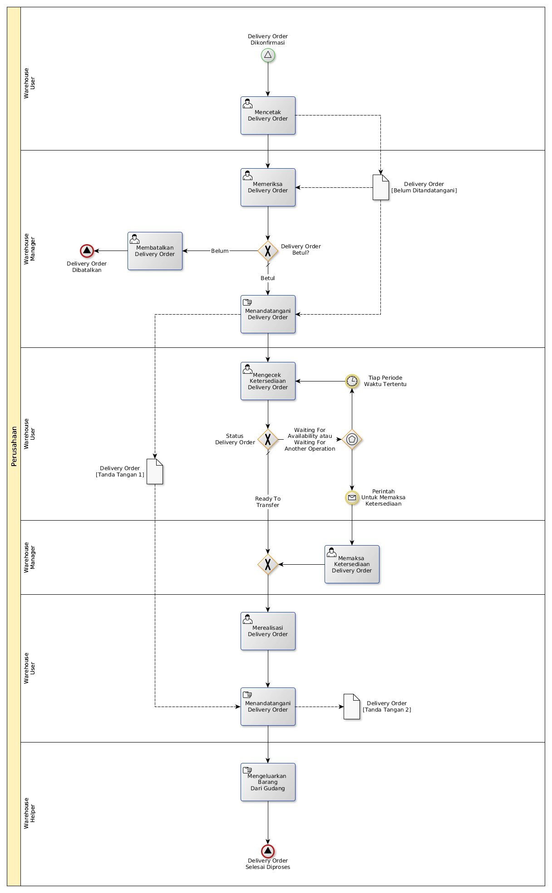

# Mengeluarkan Barang Untuk Dijual Ke Konsumen

## <a name="input">A. INPUT</a>

* *Signal*: Delivery Order dikonfirmasi

## <a name="role">B. ROLE YANG TERLIBAT</a>

* Warehouse User
* Warehouse Manager
* Warehouse Helper

## <a name="prosedur">C. PROSEDUR KERJA</a>

## <a name="output">D. OUTPUT</output>

* *Signal*: Delivery Order selesai diproses, atau
* *Signal*: Delivery Order dibatalkan
