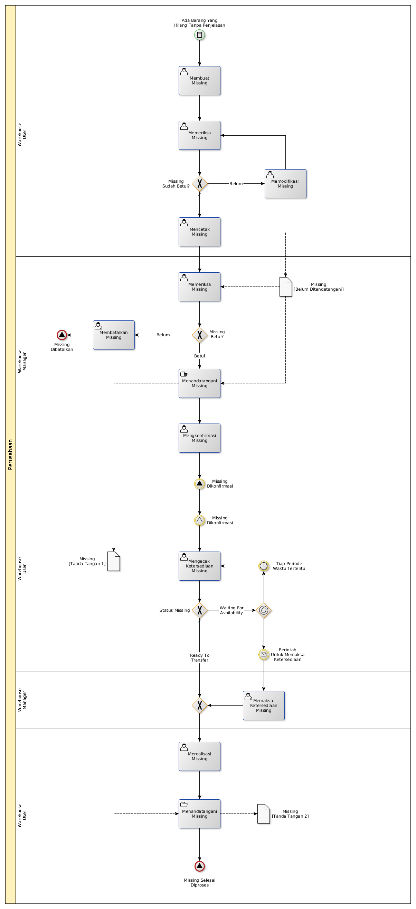

# Mencatat Barang Yang Hilang

## <a name="input">A. INPUT</a>

Ada barang yang hilang

## <a name="role">B. ROLE YANG TERLIBAT</a>

* Warehouse User
* Warehouse Manager
* Warehouse Helper

## <a name="instruksi">C. INSTRUKSI KERJA</a>

## <a name="output">D. OUTPUT</output>
